# Pewlett-Hackard-Analysis
## Introduction - SQL Tables Created
### Bobby is excited to get started on this new project. Pewlett-Hackard (PH) has fallen a bit behind in the database department, so it will be a huge achievement to get this organized for the company.  The initial step is to create a map of the database. This map will show us each table in the database and the flow of data from one table to another.  This provides us with an easy reference to the data without actually accessing it. This is called "modeling the data," and we can get started by creating a diagram with an online tool, instead of trying to make one from scratch. Our flow chart will help us navigate through the relationships more easily than if we had all six CSV files open side-by-side.  Please see the map of the quick DBD along with the table creations (ERD) below - these queries were used in SQL to export the original 6 csv files.
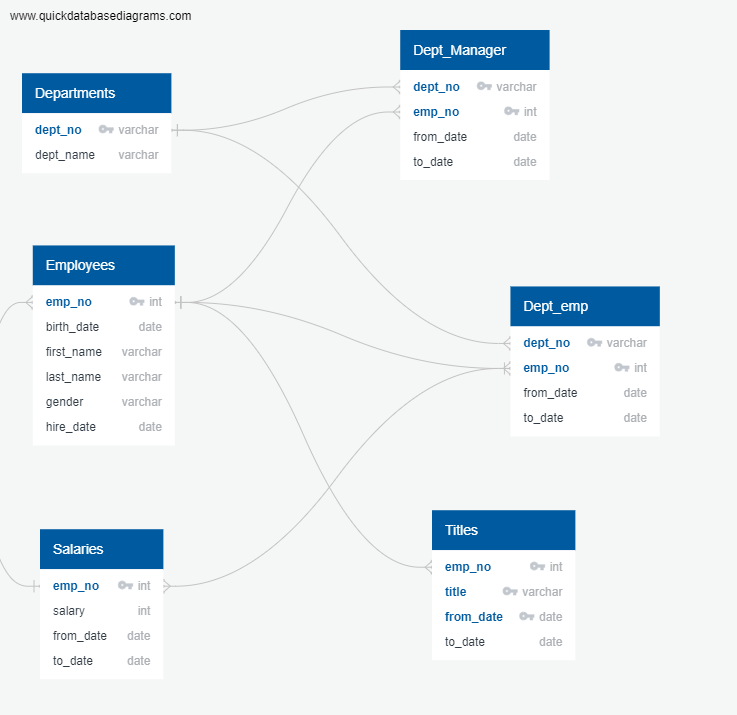
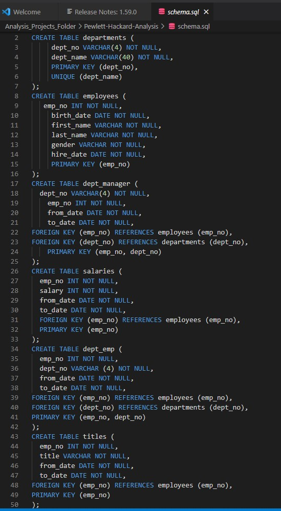

## Problem Statement - Silver Generation Conundrum - Deliverable 1
### After creating numerous joined tables in SQL, there appears to be a significant aging of the workforce and PH needs to be prepared.  The purpose of these upcoming deliverables is to quantify and provide possible solutions to potential knowledge chasm.  
This will be achieved by: 
* 1. Finding the number of retiring employees by title.
* 2. Finding the employees eligible for the mentorship program.
### In order to retrieve the number of employees retiring by title, we first must export the number of retirement titles with the following script and output shown below.
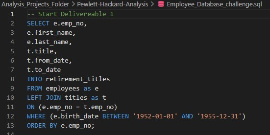
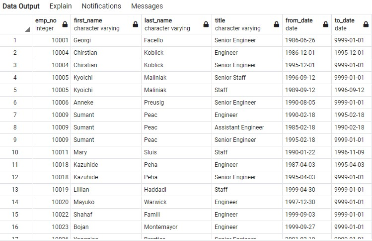
### There are duplicate entries for some employees due to switching roles over the years - Therefore the DISTINCT ON statement was utilized to initiate the unique titles table.  The unique table was also sorted by to_date in order to find the most recent job title by employee number.
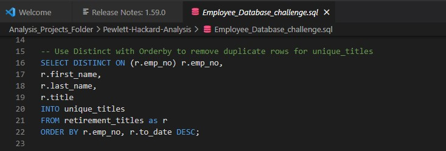
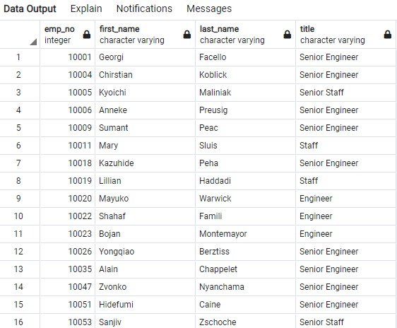
### Finally, the COUNT statement was used to collect the number of employees by their most recent job title who are about to retire as shown below.  

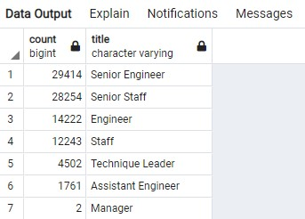
### No matter the size of PH, that is a staggering number of senior engineers and technical staff slated to retire (90,398).  The knowledge lost through this silver generation would be crippling unless something is done to stem this tide.
## Mentorship Program Solution - Deliverable 2
### In theory, a mentorship program is a logical step in stemming the wave of lost knowledge and experience.  In the Employee_Database_challenge.sql file, a query was written to create a Mentorship Eligibility table that holds the employees who are eligible to participate in a mentorship program.  
### This was achieved by:
* 1. Retrieve the emp_no, first_name, last_name, and birth_date columns from the Employees table.
* 2. Retrieve the from_date and to_date columns from the Department Employee table.
* 3. Retrieve the title column from the Titles table.
* 4. Use a DISTINCT ON statement to retrieve the first occurrence of the employee number for each set of rows defined by the ON () clause.
* 5. Create a new table using the INTO clause.
* 6. Join the Employees and the Department Employee tables on the primary key.
* 7. Join the Employees and the Titles tables on the primary key.
* 8. Filter the data on the to_date column to all the current employees, then filter the data on the birth_date columns to get all the employees whose birth dates are between January 1, 1965, and December 31, 1965.
* 9. Order the table by the employee number.
* 10. Export the Mentorship Eligibility table as mentorship_eligibilty.csv
### The query and the output is shown below.
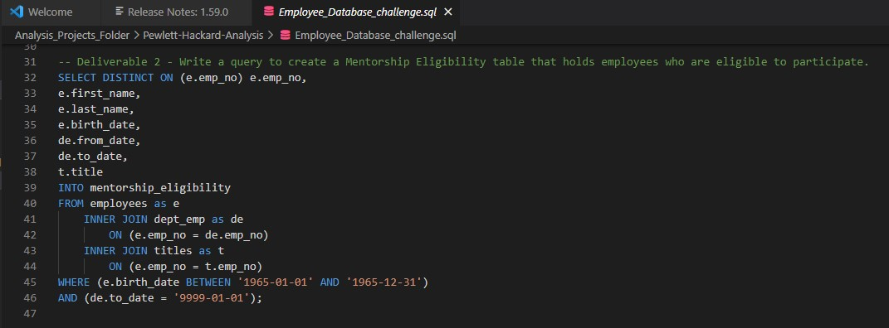
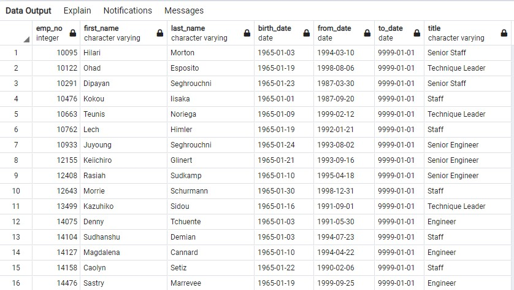
## Conclusions - Results and Summary
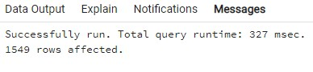
### The output above shows the number of eligible current employees available for the mentorship program.  1549 employees are a good start, however there are over 90,000 employees slated to retire.  
### Results:
* 1. That means these 1549 employees would have to mentor an average of 58+ employees.  This appears to be a massive shortfall.
* 2. There needed to be some newer blood in PH a while ago - it is imperative to retain the talent on hand.  PH needs to find more incentives to retain their aging talent, so they have time to replenish with new employees.
* 3. The most attention has to be paid to Senior Engineers and Engineers - These 2 groups alone account for almost 50% of the silver tsunami.
* 4. There are very few Managers slated to retire - This seems a little peculiar.  More attention needs to be paid to the PH organization chart - This could be part of the incentive plan to attract the aging talent to stick around longer.

### Summary
### A possible solution to the mentorship program shortfall is to expand the search criteria by including employees born in 1964 - this simple change alone allows for more than 18000 more possible mentors.  Please see below.
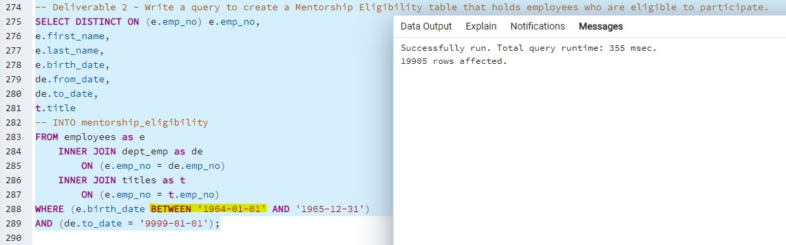
### Expanding the age criteria 1963 doubles the amount of potential mentors - please see below.
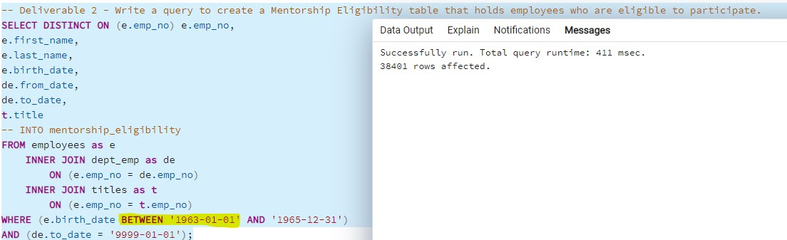
### Another possible solution is to offer more soft incentives to the silver generation - more paid time off / vacation time, better health insurance coverage.
