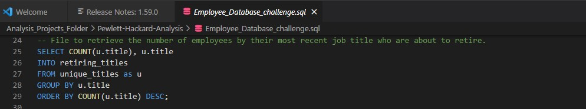

# Pewlett-Hackard-Analysis
## Introduction - SQL Tables Created
### Bobby is excited to get started on this new project. Pewlett-Hackard has fallen a bit behind in the database department, so it will be a huge achievement to get this organized for the company.  The initial step is to create a map of the database. This map will show us each table in the database and the flow of data from one table to another.  This provides us with an easy reference to the data without actually accessing it. This is called "modeling the data," and we can get started by creating a diagram with an online tool, instead of trying to make one from scratch. Our flow chart will help us navigate through the relationships more easily than if we had all six CSV files open side-by-side.  Please see the map of the quick DBD along with the table creations (ERD) below - these queries were used in SQL to export the original 6 csv files.

## Problem Statement - Silver Generation Conundrum - Deliverable 1
### After creating numerous joined tables in SQL, there are more deliverables to be done.  
* 1. The number of retiring employees by title.
* 2. The employees eligible for the mentorship program.
### In order to retrieve the number of employees retiring by title, we first must export the number of retirement titles with the following script and output shown below.

## Mentorship Program Solution - Deliverable 2

## Conclusions
Queries/Data/employees.csv
